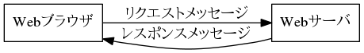
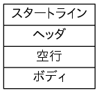

% Webのアーキテクチャ
% 2017年3月22日
% 五十嵐 浩人

# Web概論

# URI

# HTTP

## HTTPの基本
HTTPはTCP/IPをベースとしたプロトコルです。

### HTTPの重要性
HTTPはRFC2616で規定されたプロトコルです。RFC2616で規定してるバージョンは1.1で、これが現時点での最新バージョンです。現在のWebではこのバージョンのHTTPが最もよく使われています。

HTTPはHTMLやXMLなどのハイパーテキストだけではなく、静止画、音声、動画、JavaScriptプログラム、PDFや各種オフィスドキュメントファイルなど、コンピュータで扱えるデータであれば何でも転送できます。

### TCP/IPとは重要性

### HTTPのバージョン

### クライアントとサーバ
Webはアーキテクチャにクライアント/サーバを採用しています。クライアント(Webブラウザ)が情報を提供するサーバ(Webサーバ)に接続し、各種のリクエスト(Request、要求)を出してレスポンス(Response、応答)を受け取ります。

### リクエストとレスポンス
HTTPではクライアントが出したリクエストをサーバで処理してレスポンスを返します。このようなブロトコルのことをリクエスト/レスポンス型(Request-Response Style)のプロトコルと呼びます。

#### クライアントで行われること
クライアントでは、1つのリクエストを送信しレスポンスを受信する際に、次のことを行います。

1. リクエストメッセージの構築
1. リクエストメッセージの送信
1. (レスポンスが返るまで待機)
1. レスポンスメッセージの受信
1. レスポンスメッセージの解析
1. クライアントの目的を達成するために必要な処理

#### サーバで行われること
クライアントからリクエストを受けたサーバは次のことを行います。

1. (リクエストの待機)
1. リクエストメッセージの受信
1. リクエストメッセージの解析
1. 適切なアプリケーションプログラムへの処理の移譲
1. アプリプログラムからの結果を取得
1. レスポンスメッセージの構築
1. レスポンスメッセージの送信

### HTTPメッセージ
リクエストメッセージとレスポンスメッセージをまとめて「HTTPメッセージ」と呼びます。

HTTPメッセージの構造は下図のようになります。

1行目は「スタートライン」(Start Line)です。スタートラインは、リクエストメッセージの場合はリクエストライン、レスポンスメッセージの場合はステータスラインです。

### HTTPのステートレス性

### シンプルなプロトコルであることの強み

## HTTPメソッド

## ステータスコード

### ステータスコードの重要性

### ステータスラインのおさらい

### ステータスコードの分類と意味

ステータスコードは3桁の数字であり、先頭の数字によって次の5つに分類されます。

* 1xx: 処理中

    処理が継続していることを示す。クライアントはそのままリクエストを継続するか、サーバの指示に従ってプロトコルをアップデートして再送信する。

* 2xx: 成功

    リクエストが成功したことを示す。

* 3xx: リダイレクト

    他のリソースへのリダイレクトを示す。クライアントはこのステータスコードを受け取ったとき、レスポンスメッセージのLocationヘッダを見て新しいリソースへ接続する。

* 4xx: クライアントエラー

    クライアントエラーを示す。原因はクライアントのリクエストにある。エラーを解消しない限り正常な結果を得られないので、同じリクエストをそのまま再送信することはできない。

* 5xx: サーバーエラー

    サーバーエラーを示す。原因はサーバ側にある。サーバ側の原因が解決すれば、同一のリクエストを再送信して正常な結果が得られる可能性がある。

### よく使われるステータスコード

|ステータスコード          |説明                    |
|--------------------------|------------------------|
|200 OK                    |リクエスト成功          |
|201 Created               |リソースの作成成功      |
|301 Moved Permanently     |リソースの恒久的な移動  |
|303 See Other             |別URIの参照             |
|400 Bad Request           |リクエストの間違い      |
|401 Unauthorized          |アクセス権不正          |
|404 Not Found             |リソースの不在          |
|500 Internal Server Error |サーバ内部エラー        |
|503 Service Unabailable   |サービス停止            |

### ステータスコードとエラー処理

### ステータスコードの誤用

### ステータスコードを意識して設計する

## HTTPヘッダ

### HTTPヘッダの重要性

### HTTPヘッダの生い立ち

### 日時

### MIMEメディアタイプ

### 言語タグ

### コンテントネゴシエーション

### Content-Lengthとチャンク転送

### 認証

### キャッシュ

### 持続的接続

### そのほかのHTTPヘッダ

### HTTPヘッダを活用するために

# ハイパーメディアフォーマット

## HTML

### HTMLとは何か

### メディアタイプ

### 拡張子

### XMLの基礎知識

### HTMLの構成要素

### リンク

### リンク関係

### ハイパーメディアフォーマットとしてのHTML

## microformats

## Atom

## Atom Publishing Protocol

## JSON

# Webサービスの設計

# 付録

## ステータスコード一覧

## HTTPヘッダ一覧

## 解説付き参考文献

